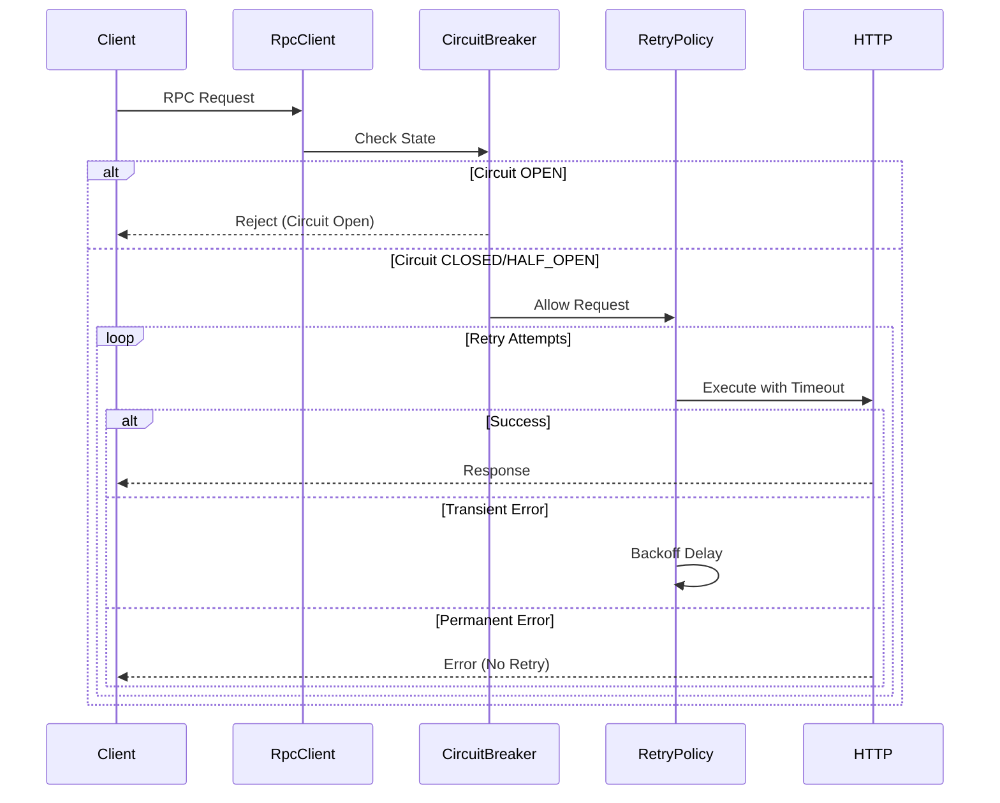

# Design Document: Stellar RPC Client Wrapper

## Overview

The Stellar RPC Client Wrapper provides a resilient, observable HTTP client for communicating with Stellar RPC nodes. It implements operator-grade reliability patterns including configurable timeouts, exponential backoff retries, circuit breaker protection, and comprehensive logging. The wrapper exposes typed methods for common Stellar RPC operations while maintaining compatibility with the existing Express middleware stack.

The design prioritizes fail-safe behavior: transient failures trigger automatic retries with backoff, permanent errors fail immediately without retry, and prolonged outages trigger circuit breaker protection to prevent resource exhaustion. All behavior is logged with correlation IDs for operator diagnosis without tribal knowledge.

## Architecture

### Component Structure

```
StellarRpcClient
├── Configuration (endpoint, timeouts, retry policy)
├── CircuitBreaker (state machine: CLOSED/OPEN/HALF_OPEN)
├── RetryPolicy (exponential backoff with jitter)
├── RequestExecutor (HTTP client with timeout enforcement)
├── MetricsCollector (counters, histograms)
└── RpcMethods (typed Stellar operations)
```

### State Management

The circuit breaker maintains three states:
- **CLOSED**: Normal operation, all requests allowed
- **OPEN**: Failure threshold exceeded, all requests rejected immediately
- **HALF_OPEN**: Recovery probe state, single request allowed to test health

State transitions:
```
CLOSED --[failure threshold exceeded]--> OPEN
OPEN --[recovery timeout elapsed]--> HALF_OPEN
HALF_OPEN --[probe success]--> CLOSED
HALF_OPEN --[probe failure]--> OPEN
```

### Request Flow



## Components and Interfaces

### StellarRpcClientConfig

Configuration interface for client initialization:

```typescript
interface StellarRpcClientConfig {
  endpoint: string;                    // RPC endpoint URL
  timeout: number;                     // Request timeout in milliseconds
  maxRetries: number;                  // Maximum retry attempts
  initialBackoff: number;              // Initial backoff delay in milliseconds
  maxBackoff: number;                  // Maximum backoff delay in milliseconds
  circuitBreakerThreshold: number;     // Consecutive failures before opening circuit
  circuitBreakerRecoveryTimeout: number; // Time in ms before attempting recovery
}
```

Validation rules:
- `timeout` must be positive integer
- `maxRetries` must be non-negative integer
- `initialBackoff` and `maxBackoff` must be positive integers
- `maxBackoff` must be >= `initialBackoff`
- `circuitBreakerThreshold` must be positive integer
- `circuitBreakerRecoveryTimeout` must be positive integer

### StellarRpcClient

Main client class:

```typescript
class StellarRpcClient {
  constructor(config: StellarRpcClientConfig);
  
  // Stellar RPC methods
  getAccount(accountId: string, options?: RequestOptions): Promise<AccountResponse>;
  getTransaction(txHash: string, options?: RequestOptions): Promise<TransactionResponse>;
  submitTransaction(signedTx: string, options?: RequestOptions): Promise<SubmitResponse>;
  getLedger(sequence: number, options?: RequestOptions): Promise<LedgerResponse>;
  getEvents(filters: EventFilters, options?: RequestOptions): Promise<EventsResponse>;
  
  // Health and metrics
  healthCheck(): Promise<HealthCheckResult>;
  getMetrics(): MetricsSnapshot;
  resetMetrics(): void;
}

interface RequestOptions {
  signal?: AbortSignal;      // For request cancellation
  correlationId?: string;    // For request tracing
}
```

### CircuitBreaker

Circuit breaker state machine:

```typescript
enum CircuitState {
  CLOSED = 'CLOSED',
  OPEN = 'OPEN',
  HALF_OPEN = 'HALF_OPEN'
}

class CircuitBreaker {
  private state: CircuitState = CircuitState.CLOSED;
  private consecutiveFailures: number = 0;
  private lastFailureTime: number = 0;
  
  constructor(
    private threshold: number,
    private recoveryTimeout: number
  );
  
  canExecute(): boolean;
  recordSuccess(): void;
  recordFailure(): void;
  getState(): CircuitState;
}
```

### RetryPolicy

Exponential backoff with jitter:

```typescript
class RetryPolicy {
  constructor(
    private maxRetries: number,
    private initialBackoff: number,
    private maxBackoff: number
  );
  
  shouldRetry(attempt: number, error: RpcError): boolean;
  getBackoffDelay(attempt: number): number;
}
```

Backoff calculation:
```
baseDelay = min(initialBackoff * (2 ^ attempt), maxBackoff)
jitter = random(0, baseDelay * 0.2)
actualDelay = baseDelay + jitter
```

### Error Classes

Custom error hierarchy:

```typescript
class RpcError extends Error {
  constructor(
    message: string,
    public readonly code: string,
    public readonly statusCode?: number,
    public readonly correlationId?: string
  );
}

class RpcTimeoutError extends RpcError {
  constructor(message: string, correlationId?: string);
}

class RpcRetryExhaustedError extends RpcError {
  constructor(
    message: string,
    public readonly attempts: number,
    public readonly lastError: Error,
    correlationId?: string
  );
}

class RpcCircuitOpenError extends RpcError {
  constructor(message: string, correlationId?: string);
}

class RpcValidationError extends RpcError {
  constructor(message: string, field: string, correlationId?: string);
}
```

Error classification:

**Transient Errors** (retry eligible):
- HTTP 408 (Request Timeout)
- HTTP 429 (Too Many Requests)
- HTTP 500 (Internal Server Error)
- HTTP 502 (Bad Gateway)
- HTTP 503 (Service Unavailable)
- HTTP 504 (Gateway Timeout)
- Network timeout (ETIMEDOUT)
- Connection refused (ECONNREFUSED)

**Permanent Errors** (fail fast):
- HTTP 400 (Bad Request)
- HTTP 401 (Unauthorized)
- HTTP 403 (Forbidden)
- HTTP 404 (Not Found)
- HTTP 405 (Method Not Allowed)
- HTTP 422 (Unprocessable Entity)
- JSON parsing errors
- Request validation errors
- Response validation errors

### MetricsCollector

Metrics tracking:

```typescript
interface MetricsSnapshot {
  totalRequests: number;
  successfulRequests: number;
  failedRequests: Record<string, number>;  // By error type
  retryAttempts: number;
  circuitBreakerState: CircuitState;
  consecutiveFailures: number;
  latencyHistogram: {
    p50: number;
    p95: number;
    p99: number;
    max: number;
  };
}

class MetricsCollector {
  recordRequest(): void;
  recordSuccess(latency: number): void;
  recordFailure(errorType: string, latency: number): void;
  recordRetry(): void;
  getSnapshot(): MetricsSnapshot;
  reset(): void;
}
```

## Data Models

### Stellar RPC Request/Response Types

```typescript
// Account query
interface AccountResponse {
  id: string;              // Stellar account ID
  sequence: string;        // Account sequence number (decimal string)
  balances: Balance[];
}

interface Balance {
  asset: string;
  amount: string;          // Decimal string for precision
}

// Transaction query
interface TransactionResponse {
  hash: string;
  ledger: number;
  status: 'SUCCESS' | 'FAILED';
  createdAt: string;       // ISO 8601 timestamp
  operations: Operation[];
}

interface Operation {
  type: string;
  source?: string;
  [key: string]: unknown;
}

// Transaction submission
interface SubmitResponse {
  hash: string;
  status: 'PENDING' | 'DUPLICATE' | 'ERROR';
  errorMessage?: string;
}

// Ledger query
interface LedgerResponse {
  sequence: number;
  hash: string;
  previousHash: string;
  transactionCount: number;
  closedAt: string;        // ISO 8601 timestamp
}

// Event query
interface EventFilters {
  contractId?: string;
  topics?: string[];
  startLedger?: number;
  endLedger?: number;
}

interface EventsResponse {
  events: ContractEvent[];
  latestLedger: number;
}

interface ContractEvent {
  type: string;
  ledger: number;
  contractId: string;
  topics: string[];
  data: unknown;
}

// Health check
interface HealthCheckResult {
  healthy: boolean;
  responseTime: number;    // Milliseconds
  circuitState: CircuitState;
  error?: string;
}
```

### Request Context

Internal context passed through request lifecycle:

```typescript
interface RequestContext {
  correlationId: string;
  method: string;
  endpoint: string;
  startTime: number;
  attempt: number;
  signal?: AbortSignal;
}
```

## Correctness Properties

