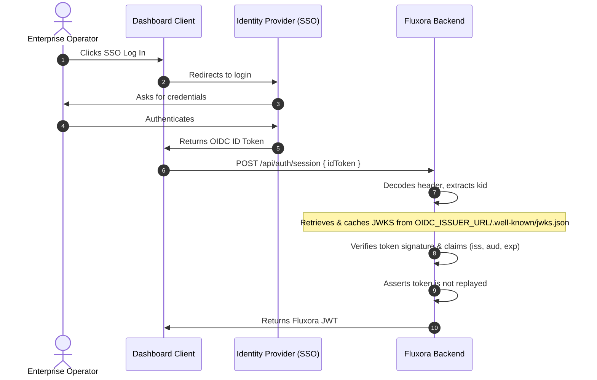

# Authentication & Authorization (RBAC)

This document describes the fine-grained permission model introduced to replace simple `role` checks.

JWT claim structure
- `address` (string): account address
- `role` (string): convenience hint (e.g. `operator`, `viewer`, `admin`)
- `permissions` (string[]): explicit permission scopes such as `streams:read` or `admin:pause`

Permission enum (representative)
- `streams:read`, `streams:write`
- `admin:pause`, `admin:reindex`, `indexer:replay`
- `dlq:list`, `dlq:read`, `dlq:replay`, `dlq:delete`
- `audit:read`, `audit:write`

Roles and default permissions
- `operator`: elevated operational permissions (streams read/write, DLQ, basic audit read)
- `viewer`: read-only (`streams:read`)
- `admin`: all permissions

Middleware
- `authenticate`: verifies JWT and validates payload with Zod (must include `permissions` array).
- `requireAuth`: ensures an authenticated user exists.
- `requirePermission(permission)`: middleware factory that ensures the caller holds the requested permission.

Notes
- Tokens without a `permissions` claim are rejected by `authenticate`.
- For backward compatibility in tests and local token generation, `generateToken()` will backfill sensible permissions based on `role` if `permissions` is not supplied.

# API Keys

Service-to-service callers authenticate with long-lived API keys instead of
JWTs. Keys are minted, rotated, and revoked through the admin API and are
persisted in PostgreSQL (`api_keys` table) so authentication state survives
restarts and is shared across all instances.

## Key format

A raw key looks like `flx_<64 hex chars>`. The leading 8 characters
(`flx_` + 4 hex) form the **prefix**, which is stored as an indexed lookup
column. The raw key is returned **exactly once** at creation/rotation and is
never recoverable afterwards.

## Storage & hashing

The raw key is never stored. For each key we persist:

| Column     | Purpose |
| :--------- | :------ |
| `key_hash` | `HMAC-SHA256(pepper, salt ‖ rawKey)`, hex-encoded |
| `salt`     | Per-key random 16-byte value (hex) |
| `prefix`   | Indexed lookup column (first 8 chars of the raw key) |

- **Per-key salt** defeats precomputed rainbow tables, even across keys that
  share material.
- **Server-side pepper** (`API_KEY_PEPPER`) is mixed into every hash and is
  *never* stored in the database. A leaked `api_keys` table therefore cannot be
  brute-forced offline without also compromising the application secret. The
  pepper is read from the validated env var only and is never logged (it is in
  the secret deny-list, see `src/pii/sanitizer.ts`).

## Validation (constant time, no full scan)

`isValidApiKey()` derives the prefix from the presented key, fetches the small
set of active rows sharing that prefix via the `api_keys_prefix_active_idx`
index (O(log n) — never a full-table scan), then performs a **constant-time**
HMAC comparison against each candidate. Prefix collisions are handled safely:
every candidate in the bucket is compared, so only the key whose salted hash
matches authenticates.

## Lifecycle & auditing

Create, rotate, and revoke each write a durable row to `audit_logs`
(`API_KEY_CREATED` / `API_KEY_ROTATED` / `API_KEY_REVOKED`) via
`recordAuditEventToDb`, including the key prefix and name but never the raw key.
Rotation issues a fresh raw key and immediately invalidates the previous one;
revocation flips `active = false` so the key can no longer authenticate.

### Admin endpoints

| Method & path | Description |
| :--- | :--- |
| `POST /api/admin/api-keys` | Create a key. Body `{ "name": "service-a" }`. Returns the raw key once. |
| `GET /api/admin/api-keys` | List key metadata (hashes only — never the raw key). |
| `POST /api/admin/api-keys/:id/rotate` | Rotate a key; returns a new raw key once. |
| `DELETE /api/admin/api-keys/:id` | Revoke a key. |

## Configuration

| Environment Variable | Type | Required | Description |
| :--- | :--- | :--- | :--- |
| `API_KEY_PEPPER` | String (≥ 32 chars) | Required to mint/validate keys | Server-side pepper mixed into every API-key hash. Keep it out of the database and rotate it only with a re-hash plan, since rotating it invalidates all existing keys. |

# Authentication and Pluggable OIDC Support

Fluxora supports two parallel authentication paths at the session creation endpoint `POST /api/auth/session` to obtain a Fluxora JWT:

1. **Shared-Secret Authentication (Fallback):** Generates a JWT using a static pre-configured secret.
2. **Pluggable OIDC/OAuth2 Authentication:** Exchanges an ID token from an external Identity Provider (SSO) for a Fluxora JWT.

---

## Configuration

To enable OIDC/OAuth2 authentication, configure the following environment variables:

| Environment Variable | Type | Required | Description |
| :--- | :--- | :--- | :--- |
| `OIDC_ISSUER_URL` | URL | No | The base URL of the identity provider (e.g. `https://keycloak.example.com/realms/myrealm` or `https://auth0.com`). If set, OIDC authentication is enabled. |
| `OIDC_AUDIENCE` | String | No | The client ID / audience expected in incoming ID tokens. Signature claims validation will enforce this check if set. |

---

## Flow: OIDC ID Token Exchange

Enterprise dashboard clients or operators can exchange their OIDC ID Token for a Fluxora JWT.



### Request Example
```http
POST /api/auth/session
Content-Type: application/json

{
  "idToken": "eyJhbGciOiJSUzI1NiIsImtpZCI6ImtleS1pZC0xIi... "
}
```

### Response Example
```json
{
  "token": "eyJhbGciOiJIUzI1NiIsInR5cCI6IkpXVCJ9...",
  "user": {
    "address": "GCSX22222222222222222222222222222222222222222222222222UV",
    "role": "operator"
  }
}
```

---

## Security & Implementation Details

- **JWKS Cache Policy:** The JWKS retrieved from the provider is cached in Redis (under the key `fluxora:jwks:<issuer_url>`) and locally in memory for 24 hours to reduce latency.
- **Key Rotation Support:** If a token contains a `kid` that is not found in the cache, Fluxora will automatically perform a force refresh once to fetch fresh keys from the provider.
- **Token Replay Prevention:** Verified ID tokens are hashed via SHA-256 and registered in Redis (and memory) with a TTL matching the token's expiration (`exp`). If a duplicate token is presented during this period, it is rejected with an unauthorized error.
- **Address Claims Mapping:** To map the SSO identity to a Stellar account address, Fluxora parses claims in the following order of precedence:
  1. `stellar_address`
  2. `address`
  3. `sub`
